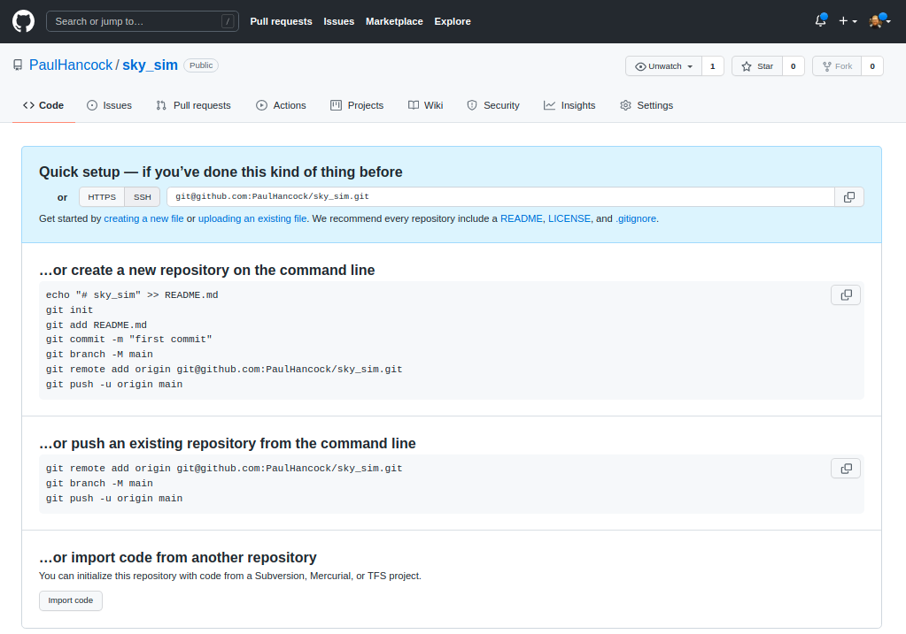

::::::::::::::::::::::::::::::::::::::: objectives

- Build a minimal working or "proof of concept" project
that we can build on in this workshop

::::::::::::::::::::::::::::::::::::::::::::::::::

:::::::::::::::::::::::::::::::::::::::: questions

- Where/How do I start a new project?
- How do I use a function?
- How do I document and test my code?
- Can I make a command line interface for my code?

::::::::::::::::::::::::::::::::::::::::::::::::::

## Benefits and pit-falls
Working on a software project as part of a team is a very different experience from working on a solo project. There are of course great advantages to having multiple people working on a problem, but there are also some pit-falls that need to be avoided, and overheads that cannot be avoided.

### Benefits of working in a team

- Each person has different areas of expertise
- More person-hours available
- Group discussion leads to better decision making
- Group members can learn from each other faster than they can learn from a book/website
- Seeing how others work and solve problems can help you learn new skills that you didn’t know you needed
- Bug-fixing is easier when you have an informed buddy to talk to
- Work can be assigned to people with the most relevant skills increasing efficiency
- Dividing the development and testing of a work item between two people can make for better code and more complete tests

### Pit-falls to avoid

- Siloing work:
  - Separating work items can be a good idea but there needs to be frequent check-ins to ensure that the software being developed by two people is not diverging or conflicting
- Inconsistent standards:
  - Even though people may have personal preferences or styles, documentation, commenting, and testing should be consistent across a code base.
- Non-constructive criticism:
  - When things work they just work and no one talks about it
  - When things break everyone talks about it
  - Given that issues result from negative experiences, it is important for team moral to always try and keep feedback as constructive as possible
- Platform / dependency conflicts:
  - There is no guarantee that all developers will be using the same operating system or development tools.
  - Allowing people the freedom to choose is important but the differences need to be managed via an agreement on how/when/where testing takes place, what acceptance looks like, and the use of a style guide.
  - Having some files with windows style end of line and others with linux style end of line can make it tedious to track changes

### Overheads that cannot (should not) be avoided

Project management will take time, and may not be a skill that you have. Invest time in training.
Communication and coordination take time but are vital to success
Commit conflicts will arise even if everything is done right, these need to be discussed and handled properly rather than ignored
The moral of the team is important to success and will take time and effort to maintain, but it is worth doing so that your project can see the benefits listed above.

### Summary

Working in a team can be a hugely beneficial experience for all involved, however there are some negative features that need to be avoided or managed. In the next section we’ll explore how we can create and document project standards that will make working in a team much easier.

## Communication and project management

### Communication

Team work requires effective communication between team members. This helps to keep everyone up to date on the status of the project, the current and future direction of the work, and avoids duplication of effort. Email, slack, messenger, GitHub issues, chats over a coffee, or a formal weekly meeting, are all valid ways of keeping the teem together. A formal meeting once a month complimented by a weekly email to status check, and real time slack messaging for immediate questions may be a good solution for a 5 person team working on a year long project. An informal weekly chat over lunch with intermittent emails may be good for a 2 person team working on a project that lasts a few months. The most important thing is that the chosen method is effective and that it includes all team members.

If an informal or ephemeral communication medium is involved when coming to an agreement or making a decision, it is good practice to have a follow up communication to reiterate the decision and reasoning using a medium that can be archived. For example, if the team meets over a coffee, discusses a current issue, and decides on a way forward, it is a good idea for someone to follow this up with an email so that the details of the decision are not lost.

### Project management styles

The two main project management styles that are applied to software development are **waterfall** and **agile**. Neither of these are a project management methodology but are more like umbrella terms that group a set of methodologies that share a common mindset. In the waterfall mindset there is a very linear approach to the design and execution and delivery of the project with the main focus being on the process. In the agile mindset the main focus is on outcomes and deliverables, with the design and execution and delivery occurring in cycles.

#### Waterfall
In a waterfall project the whole life cycle of a project is mapped onto distinct, sequential work items, with each item relying on those that occur before, and blocking those that come after. Waterfall project management therefore represents a very rigid and linear approach. The waterfall system is a very traditional method for managing a project with participants being assigned clear roles and expectations.


Image credit: https://startinfinity.com/project-management-methodologies/waterfall


The name waterfall comes from the fact that each work item will cascade onto the next. In a waterfall project there is a lot of attention paid to defining the entirety of the project up front, and then a close adherence to the project plan and timeline. It is therefore difficult to incorporate changes into the project plan, and therefore it is hard to respond to setbacks, opportunities, or changes in requirements.

The waterfall project management style was initially designed in the 1970’s for use in software development projects. It was taken on by many other industries to great success, but is now seen as an outdated methodology for software projects.

#### Agile

In 2001 the Manifesto for Agile Software Development was published. The agile manifesto can be summed up as:

> We are uncovering better ways of developing
> software by doing it and helping others do it.
> Through this work we have come to value:
> 
> Individuals and interactions over processes and tools
> Working software over comprehensive documentation
> Customer collaboration over contract negotiation
> Responding to change over following a plan
> 
> That is, while there is value in the items on
> the right, we value the items on the left more.
> 
> https://agilemanifesto.org/

The agile manifesto is based on the following principles:

1. The highest priority is to satisfy the customer through early and continuous delivery of valuable software.
1. Welcome changing requirements, even late in development. Agile processes harness change for the customer’s competitive advantage.
1. Deliver working software frequently, from a couple of weeks to a couple of months, with a preference to the shorter timescale.
1. Business people and developers must work together daily throughout the project.
1. Build projects around motivated individuals. Give them the environment and support they need, and trust them to get the job done.
1. The most efficient and effective method of conveying information to and within a development team is face-to-face conversation.
1. Working software is the primary measure of progress.
1. Agile processes promote sustainable development. The sponsors, developers, and users should be able to maintain a constant pace indefinitely.
1. Continuous attention to technical excellence and good design enhances agility.
1. Simplicity–the art of maximising the amount of work not done–is essential.
1. The best architectures, requirements, and designs emerge from self-organising teams.
1. At regular intervals, the team reflects on how to become more effective, then tunes and adjusts its behaviour accordingly.
1. The agile mentality is designed to be able to be flexible, respond to change, deliver a working product early and have it improve incrementally over time.

Advantages of the agile mentality include:

- faster deployment of working solutions
- better quality of work
- increased client satisfaction
- reduced risk thanks to frequent testing and deployment
- increased team moral
- a project that finishes early is still able to deliver a working result

Some potential drawbacks include:

- potential for scope creep from continuous client feedback
- workload management can be difficult when duties and requirements are not known far in advance
- short development cycles can mean that skills gaps are not identified early leading to delays in delivery

You will likely see that the Agile development mentality fits much better with research project management including both traditional research work and software development projects. Additionally you may note that your organisation may employ a mix of different management methodologies for different projects, or at different levels of the organisation. Understanding the benefits and drawbacks of each will help you choose a project management style that works best for your project.

### Popular Agile methodologies

#### Scrum

Scrum is mainly focused on the idea of sprints. Sprints are where the bulk of the “work” gets done, although there is a significant amount of effort put into the preparation and planning of each sprint, and then the post-sprint review and retrospective. Sprints are typically 1-2 weeks in duration and will focus on a particular set of goals. During a sprint there is usually a daily scrum at the start of the day in which people talk about what they did the day before, what their plans are for today, and what problems they might foresee. The sprint review is about reviewing the work that was completed, reporting related to said work, and identification of incomplete work. The retrospective is a more meta-level reflection on how the sprint went, meant to identify how the team worked together, what organisation or communication worked well or not, and what changes could be made to make the next sprint more productive.


Image credit: https://jordanjob.me/blog/scrum-diagram/

The scrum methodology is based on team work and has well defined roles. The benefits of scrum include the ability to react to changes in requirements or resourcing, continuous testing/integration is effectively built in, prioritisation of tasks can be adjusted throughout the process. The disadvantages of scrum are that you need very good organisation before each sprint to maximise productivity. Additionally it requires that team members are able to block out a 1-2 week period in which they focus solely on the sprint and maintain a high focus. Clearly, scrum requires a medium to large team (5+) in order to be effective.

#### Kanban

In the Kanban methodology the main focus is on the visualisation that is used during the development process – the Kanban board. One goal of the board is to identify potential bottlenecks in the process. An example board is shown below with the following features:

**Tasks** that are represented as squares. Sticky notes or cards are often used on a physical wall, or their digital representation online.

**Columns** that represent the state of each task. A task is expected to migrate from the left most column (Ready/Backlog) through the central columns and into the final (Done/Complete) column, as the related work is being done.

**Work in progress limits**. In order to maintain focus and productivity, there are often limits on the number of cards that can be placed into some of the columns. In particular the “in progress” and “testing” columns are limited by the available people time allocated to the project.

**Swim lanes** (not shown), are rows that separate tasks based on categories of work such as documentation, testing, or reporting. Alternatively, colour coding of cards can be used to identify these categories.


Image credit: https://startinfinity.com/project-management-methodologies/kanban

Even when the Kanban methodology is not being explicitly used, the visualisation process is so powerful that it often used in many other project management strategies. It’s not uncommon to see a Kanban board on the wall during a two week sprint.

The advantage of Kanban is that you have a single place to track the progress of all the tasks, and bottle necks can be quickly identified. One of the main disadvantages of Kanban come from people failing to update the Kanban board as a task is being worked on (poor communication), or updating too often (high overhead). Many project management software tools incorporate a Kanban board and tools like JIRA even have a way of migrating and updating tasks based on activity in a linked GitHub repository so that people can keep the Kanban up to date without having to visit the board itself.

### Summary
Communication and effective project management are critical to the success of any collaborative project. There is no one-size-fits-all solution, and you will need to consider the project requirements, and the size and expertise of your team when deciding on a communication and management strategy. Thankfully there are many project management tools online that are free that will support whatever choice you make.

## Member roles

Depending on the scope of your project, the size of the team, and the management strategy that is being used, you will have a number of roles that need to be filled within the team. Below is a list of some common roles that may be applicable to your project along with a short description. It should be noted that not all roles are required for all projects, and that the roles do not need to map to people on a 1:1 basis. It is normal to have multiple people per role and to have some people acting in multiple roles. The most important thing is that you consider the different roles and responsibilities, and have at least an implicit agreement on who is going to be filling each of the roles. This will help people to understand their responsibilities and who they should be handing work over to or working with during the project development.

### Roles
- Software Developer
  - Primarily focused on writing the software, fixing bugs, implementing new features.
  - Should be responsive to issues, and provide implementation advice to the team.
  - Documentation and Test Developer
  - Primarily focused on the creation of documentation and developing tests.
  - Test cases and docstrings should be consistent.
  - Typically also will be responsible for automating the testing process and reporting issues.
  - Documentation can be focused on docstrings but can also include online documentation, help files, tutorials, and examples.
- Product Owner
  - The person who takes responsibility for setting the software project goals.
  - This person is tasked with understanding the client/user needs and translating them into user stories, milestones, and tasks.
- Domain Expert
  - Someone who has a good understanding of the context in which the software will be deployed or used.
  - When developing software for astronomers, it is not essential for all the development team to have a good understanding of the general or specific field of application.
  - A domain expert can be an internal point of contact for the development team when they have questions about the correctness or utility of an aspect of theproject.
- Project Manager
  - Primarily focused on the organisation of the team, ensuring that team members have tasks matched to their skills, and that the required skills are available within the team.
  - The project manager will be responsible for the timing and scheduling of work and deadlines.
- Reviewer
  - Any piece of work that is completed should be assigned to a reviewer to ensure that the work is up to standard.
  - The reviewer should have a good understanding of the goals of a piece of work and be able to give feedback on areas that need improvement.
  - The reviewer should ideally not be involved in the development of the piece of work they are reviewing.
- Approver
  - Similar to a reviewer, except that there is no requirement for an approver to understand the implementation of the work being done.
  - An approver is focused on ensuring that the proper procedures have been followed.
- User Acceptance Tester
  - Someone who is able to perform the necessary tests to ensure that each of the user stories have been met.
  - Acceptance testing is typically not able to be automated and will require manual interaction to ensure that the end user can perform the tasks outline in the user stories.

The following workflow describes the interaction of the above roles within a generic software project:


Solid lines indicate the flow of content for action, approval, or feedback. Dashed lines indicate input in the form of advice or oversight.


:::: challenge

## GROUP Activity: Who does what and when?

Within your software project group review the past three lessons and discuss the following:

- What software development roles are required for your project?
- What project management roles are required for your project?
- Are there any roles that would be beneficial to your project that are not listed?
- How are these roles distributed among the team?
- Are there people with multiple roles or roles shared among multiple people?
- Who determines the timeline and deliverables for this project?
- Is the timeline flexible?
- Can you classify the deliverables as one of required/desired/optional?
- How often and in what format should communication be managed?

*If* you have been involved in a previous software development project, please share the following with your teammates:

- What practices worked well and could be brought into this and future projects?
- What practices didn’t work well and should be avoided in the future?
- Was the previous project larger or smaller than the current one and how would that affect your choice of management/communication?

::::

## Create project standards and expectations

When a single person is working on a project there will typically be a consistency imposed simply by the fact that the developer has ‘their way’ of doing things (though this consistency may not exist through time). When multiple developers are working on a project it is good practice to have an agreed up on set of standards that will be followed to ensure that the project has a consistent style and that common practices are followed. These practices can include how/when to test, the branch/develop/merge cycle, documentation formats, as well as code style. A common place to note these standards and expectations is in the `CONTRIBUTING.md` file in the root of your software project. This file should be considered to be supplementary to the `README.md` file, and for a slightly different audience. Whilst the README.md file is aimed at users of the software, the `CONTRIBUTING.md` file is aimed at people who might develop the software, give feedback, or submit bug/feature requests.

### Sections to consider for `CONTRIBUTING.md`
- Welcome and encourage people to contribute to the project
- Table of Contents (especially if the file is long)
- Style guide
  - List standards for code style
  - Consider using a linter and listing it here (with settings)
  - Note the docstring format and guidelines
- Testing
  - Where the tests are located
  - How the test are run
  - The machine/environment on which the tests are expected to pass
- How to submit changes
- Who can submit changes
- Expectations for what changes will be accepted
- The pull request approval process
- How to report a bug
  - What is expected for a good bug report
  - What tags/categories should be used when submitting a report
  - How to request an “enhancement”
  - What enhancements are likely to be support and which are not
- Templates
- Examples for enhancement / bug report / change requests.
- Code of Conduct
  - Expectations for behaviour when contributing to the project
  - Consequences for breaching the code of conduct
- Email/web address for reporting breaches
- Recognition model
  - Let people know how their contributions will be recognised.
  - The following may be appropriate:
    - An acknowledgement section on the wiki
    - Co-authorship or acknowledgements in a published paper
    - Invitation to join as github contributor
    - A shout out on social media
    - A beverage of choice

The `CONTRIBUTING.md` file can become quite long if all of the above are included. The key is to have a record of how people should interact with others and with the project and that the project maintainers adhere to these guide lines.

## Creating a GitHub repository

At the moment we have a bunch of code, documentation, and associated files. We wish to make these available to others in the easiest way possible. We could just zip them all up and email to collaborators. However this means that collaborators no longer benefit from any future development that you do, and even worse, will start asking questions about code that may have diverged from the version you are working on. A solution to this problem is to keep all your code under [version control](https://swcarpentry.github.io/git-novice/), and to make use of one of the many free, online repositories to host a copy of the code. For this lesson we’ll focus on [GitHub](http://github.com/), but [gitlab](http://gitlab.com/) and [bitbucket](https://bitbucket.org/product) are also good alternatives.

#### Create an account on Github

Github accounts are free, you just need an email address to sign up. Since some academic institutions shut off your email address promptly when your contract ends, it may be a good idea to use a non-institutional or personal email to sign up to github or other services that will outlast your current contract.

#### Create a new repository on Github

Go to Github and sign in. You should be taken to a page which has a listing of your repositories and a green button to create a new one. Click the button and you should see a screen similar to the following.


For now, lets create a truly empty repository so don’t select any of the last three boxes. Just give the repo a name (your project name is a good choice if available). You can change the description later or fill it in now.

Once you create the repository you’ll see a set of instructions about what to do next.



Now we are going to go with “create a new repository from the command line”.

The first part is to make a new local git repository using init / add / commit and to name the branch to be main ([instead of master](https://sfconservancy.org/news/2020/jun/23/gitbranchname/)).

```bash
git init
git add README.md
git add requirements.txt encironment.yml
git add sim_catalog skysim/*.py
git commit -m "first commit"
git branch -M main
```

The next step is to link your local repository with the one that you just created on Github. Replace `PaulHancock/sky_sim.git` with your username and the name of the repo that you chose.

```bash
git remote add origin git@github.com:PaulHancock/sky_sim.git
git push -u origin main
```

After you have done the `git push` you’ll have added all your local changes to the remote repository and you can view the new state of the project on Github. Note how your `README.md` file gets rendered into a nice splash page.

When you push to `origin main` you’ll have to authenticate with Github, see [here](https://docs.github.com/en/authentication/connecting-to-github-with-ssh) for instructions on how to set that up for ssh.

If you set your repository to be public then anyone on the internet can see and download your code, they can make a fork (copy) of it to work on themselves, and can even send feature requests or bug reports via the issue tracker. We will get into those features later, but for now all you need to do is let your collaborators know that your code is available on Github, send them the link, and then they can download/clone it as needed. An added bonus is that as you make changes to your code, and then `add/commit/push` these changes, your collaborators can then pull those changes and get the updates without having to bug you about it.