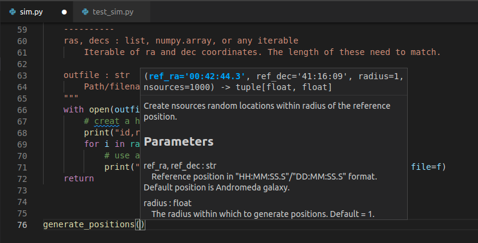
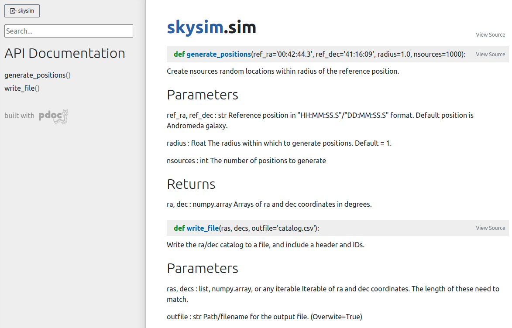

::::::::::::::::::::::::::::::::::::::: objectives

- Understand why testing and documentation is important.
- Add documentation to your project.
- Document your work.

::::::::::::::::::::::::::::::::::::::::::::::::::

:::::::::::::::::::::::::::::::::::::::: questions

- How can I easily document my code?
- Why is documentation and testing even needed?
- How do I write and run test on my code?

::::::::::::::::::::::::::::::::::::::::::::::::::

## Documenting via docstrings

To avoid simulating the entire python interpreter in our minds, it is often easier to document the (intended) behavior of our code in a human readable format. Python offers the builtin function `help()` to display the documentation for a given function. For example, if we want to know what the `numpy.sum` function does we can just ask:

```bash
>>> import numpy as np
>>> help(np.sum)
Help on function sum in module numpy:

sum(a, axis=None, dtype=None, out=None, keepdims=<no value>, initial=<no value>, where=<no value>)
    Sum of array elements over a given axis.
    
    Parameters
    ----------
    a : array_like
        Elements to sum.
    axis : None or int or tuple of ints, optional
        Axis or axes along which a sum is performed.  The default,
        axis=None, will sum all of the elements of the input array.  If
        axis is negative it counts from the last to the first axis.
    
        .. versionadded:: 1.7.0
    
        If axis is a tuple of ints, a sum is performed on all of the axes
        specified in the tuple instead of a single axis or all the axes as
        before.
    dtype : dtype, optional
        The type of the returned array and of the accumulator in which the
        elements are summed.  The dtype of `a` is used by default unless `a`
        has an integer dtype of less precision than the default platform
...
```

Where does `help()` get all this information from? In part, the information provided by help is part of the docstring for the enumerate function. We can view the docstring by viewing the `__doc__` attribute of the function as follows:

```bash
>>> print(np.sum.__doc__)

    Sum of array elements over a given axis.

    Parameters
    ----------
    a : array_like
        Elements to sum.
    axis : None or int or tuple of ints, optional
        Axis or axes along which a sum is performed.  The default,
        axis=None, will sum all of the elements of the input array.  If
        axis is negative it counts from the last to the first axis.

        .. versionadded:: 1.7.0

        If axis is a tuple of ints, a sum is performed on all of the axes
        specified in the tuple instead of a single axis or all the axes as
        before.
...
```

### Documentation vs commenting

There are two ways in which you can and should describe your code – documentation and commenting. These two ways of describing code have two audiences (which may overlap) – documentation is for the people who will **use** your code, whilst comments are for people who will **develop** your code. Both of these audiences include you, the original developer, some 6 months in the future when you have forgotten all the details about what you were doing. Quite simply:

> Documentation is a love letter that you write to your future self.
> 
> - Damian Conway


### Comments
Comments should include design decisions, or explanations of difficult to interpret code chunks. Comments can include known/expected bugs or shortcomings in the code. Things that are not yet implemented, or hacks that deal with bugs in other modules, should also be in comments. Python comments come in two flavours: a single or part line comment which begins with a #, or a multiline comment which is any string literal.

```python
'''
A comment that covers more than one line
because it is just so long
'''

def my_func(num):
    # assume that num is some numeric type, or at the very least
    # an object which supports division against an integer
    ans = num / 2 # A partial line comment
    return ans
```

The partial-line comment plus multi-line commands can be used to great effect when defining functions, dictionaries, or lists:

```python
dict = {'key1': 0, # note about this item
        'key2': 1, # another note
       }

def my_func(num,
            ax, # a matplotlib axes object
            verbose=True, # TODO update to be logger.isEnabledFor(logging.DEBUG)
            **kwargs)
```

When python is interpreted (or compiled to byte-code), the interpreter will *ignore* the comments. The comments therefore only exist in the source code. Commenting your code has no effect on the behavior of your code, but it will (hopefully) increase your ability to understand what you did. Because the comments are ignored by the python interpreter only people with access to your source code will read them (developer usually), so this is a bad place to describe how your code should be used. For notes about code usage we instead use documentation.

### Docstrings

Python provides a way for use to document the code inline, using [docstrings](https://www.python.org/dev/peps/pep-0257/). Docstrings can be attached to functions, classes, or modules, and are defined using a simple syntax as follows:

```python
def my_func():
  """
  This is the doc-string for the function my_func.
  I can type anything I like in here.
  The only constraint is that I start and end with tripe quotes (' or ")
  I can use multi-line strings like this, or just a single line string if I prefer.
  """
  return
```

Docstrings can be any valid string literal, meaning that they can be encased in either single or double quotes, but they need to be triple quoted. Raw and Unicode strings are also fine.

Docstrings can be included anywhere in your code, however unless they immediately follow the beginning of a file (for modules) or the definition of a class or function, they will be ignored by the compiler. The docstrings which are defined at the start of a module/class/function will be saved to the `__doc__` attribute of that object, and can be accessed by normal python introspection.

### Docstring formats

While it is possible to include any information in any format within a docstring it is clearly better to have some consistency in the formatting.

There are, unfortunately, many ‘standard’ formats for python documentation, though they are all similarly human readable so the difference between the formats is mostly about consistency and automated documentation.

Scipy, Numpy, and astropy, all use the numpydoc format which is particularly easy to read. We will be working with the numpydoc format in this workshop.

Let’s have a look at an extensive example from the numpydoc website.

"""Docstring for the example.py module.

Modules names should have short, all-lowercase names.  The module name may
have underscores if this improves readability.

Every module should have a docstring at the very top of the file.  The
module's docstring may extend over multiple lines.  If your docstring does
extend over multiple lines, the closing three quotation marks must be on
a line by itself, preferably preceded by a blank line.

```python
"""
from __future__ import division, absolute_import, print_function

import os  # standard library imports first

# Do NOT import using *, e.g. from numpy import *
#
# Import the module using
#
#   import numpy
#
# instead or import individual functions as needed, e.g
#
#  from numpy import array, zeros
#
# If you prefer the use of abbreviated module names, we suggest the
# convention used by NumPy itself::

import numpy as np
import matplotlib as mpl
import matplotlib.pyplot as plt

# These abbreviated names are not to be used in docstrings; users must
# be able to paste and execute docstrings after importing only the
# numpy module itself, unabbreviated.


def foo(var1, var2, *args, long_var_name='hi', **kwargs):
    r"""Summarize the function in one line.

    Several sentences providing an extended description. Refer to
    variables using back-ticks, e.g. `var`.

    Parameters
    ----------
    var1 : array_like
        Array_like means all those objects -- lists, nested lists, etc. --
        that can be converted to an array.  We can also refer to
        variables like `var1`.
    var2 : int
        The type above can either refer to an actual Python type
        (e.g. ``int``), or describe the type of the variable in more
        detail, e.g. ``(N,) ndarray`` or ``array_like``.
    *args : iterable
        Other arguments.
    long_var_name : {'hi', 'ho'}, optional
        Choices in brackets, default first when optional.
    **kwargs : dict
        Keyword arguments.

    Returns
    -------
    type
        Explanation of anonymous return value of type ``type``.
    describe : type
        Explanation of return value named `describe`.
    out : type
        Explanation of `out`.
    type_without_description

    Other Parameters
    ----------------
    only_seldom_used_keywords : type
        Explanation.
    common_parameters_listed_above : type
        Explanation.

    Raises
    ------
    BadException
        Because you shouldn't have done that.

    See Also
    --------
    numpy.array : Relationship (optional).
    numpy.ndarray : Relationship (optional), which could be fairly long, in
                    which case the line wraps here.
    numpy.dot, numpy.linalg.norm, numpy.eye

    Notes
    -----
    Notes about the implementation algorithm (if needed).

    This can have multiple paragraphs.

    You may include some math:

    .. math:: X(e^{j\omega } ) = x(n)e^{ - j\omega n}

    And even use a Greek symbol like :math:`\omega` inline.

    References
    ----------
    Cite the relevant literature, e.g. [1]_.  You may also cite these
    references in the notes section above.

    .. [1] O. McNoleg, "The integration of GIS, remote sensing,
       expert systems and adaptive co-kriging for environmental habitat
       modelling of the Highland Haggis using object-oriented, fuzzy-logic
       and neural-network techniques," Computers & Geosciences, vol. 22,
       pp. 585-588, 1996.

    Examples
    --------
    These are written in doctest format, and should illustrate how to
    use the function.

    >>> a = [1, 2, 3]
    >>> print([x + 3 for x in a])
    [4, 5, 6]
    >>> print("a\nb")
    a
    b
    """
    # After closing class docstring, there should be one blank line to
    # separate following codes (according to PEP257).
    # But for function, method and module, there should be no blank lines
    # after closing the docstring.
    pass
```

The example above is intentionally extensive, but you should be able to see what is going on. There are a few parts to the documentation format, some of which are considered essential, good practice, or optional. See the numpy doc guide for a more gentle yet more complete discussion on the [numpydoc standard](https://numpydoc.readthedocs.io/en/latest/format.html#docstring-standard).

### Good practice documentation

The main goal of documentation is to describe the desired behavior or intended use of the code. As such every docstring should contain at least a one line statement that shows the intent of the code.

It is good practice to describe the expected input and output (or behavior) of your functions.

In the numpydoc format we put these into two sections:

**Parameters**: for the input
**Returns**: for the output


There is no “Modifies” section for the documentation (though you could add one if you like). If the function modifies an input but does not return the modified version as an output then this should be included as part of the long form description.

The `generate_positions` function from the example `skysim` module has the following docstring:

```python
def generate_positions(ref_ra='00:42:44.3',
                       ref_dec='41:16:09',
                       radius=1.,
                       nsources=1000):
    """
    Create nsources random locations within radius of the reference position.

    Parameters
    ----------
    ref_ra, ref_dec : str
        Reference position in "HH:MM:SS.S"/"DD:MM:SS.S" format.
        Default position is Andromeda galaxy.

    radius : float
        The radius within which to generate positions. Default = 1.

    nsources : int
        The number of positions to generate

    Returns
    -------
    ra, dec : numpy.array
        Arrays of ra and dec coordinates in degrees.
    """
```

### Optional documentation

The type of errors that are raised, and under what conditions, can be documented in the `Raises` section.

`Notes`, `References`, and `Examples`, are also useful sections but not usually applicable to all functions or classes that you will be writing. If I have used code snippets from stack-overflow or similar, then I find Notes/References section to be a good place to acknowledge and link to those resources.

The Examples section can be used to show intended use. There is an automated testing suite called doctest which will scan your docstrings looking for segments starting with >>> and then run those segments in an interactive python interpreter. A solid test suite will typically contain many tests for a single function, thus trying to embed all the tests into your docstrings just makes for very long docstrings. It is preferable to keep your testing code in the `tests` module/directory of your python module, and to use the `Examples` section only for demonstrating functionality to the end user.

### Making use of documentation

Some IDEs (the good ones) provide syntax highlighting, linting, and inline help as you write code. By providing docstrings for all your functions you can make use of the linting and inline help. Below is an example from [VSCode](https://code.visualstudio.com/) in which the docstring for a function is being shown:



You can use the help from the python console like this:

```bash
>>> from skysim import sim
>>> help(sim.generate_positions)

Help on function generate_positions in module skysim.sim:

generate_positions(ref_ra='00:42:44.3', ref_dec='41:16:09', radius=1.0, nsources=1000)
    Create nsources random locations within radius of the reference position.
    
    Parameters
    ----------
    ref_ra, ref_dec : str
        Reference position in "HH:MM:SS.S"/"DD:MM:SS.S" format.
        Default position is Andromeda galaxy.
    
    radius : float
        The radius within which to generate positions. Default = 1.
    
    nsources : int
        The number of positions to generate
    
    Returns
    -------
    ra, dec : numpy.array
        Arrays of ra and dec coordinates in degrees.
...
```

Additionally you can compile all the documentation into a website or other document using an automated documentation tool as described in the next section.

### Automated Documentation

If your docstrings are formatted in a regular way then you can make use of an automated documentation tool. There are many such tools available with a range of sophistication.

The simplest to use is the `pdoc` package which can be obtained from pypi.org. The packaged can be installed via `pip install pdoc`, and then run on our test module using `pdoc skysim`.

By default `pdoc` will start a mini web sever with the documentation on it. This should be opened in your browser by default but if it isn’t you can navigate to `localhost:8080` or `127.0.0.1:8080`. Use `<ctrl>+C` when you want to stop the web server. For the example project this is the website that is generated:



To make documentation that is less ephemeral you can use the the `-d docs` option to cause all the documentation to be built and then placed into the `docs` folder. `pdoc` only supports html output, however other auto-documentation packages such as [sphinx](https://www.sphinx-doc.org/en/master/) can write latex (and thus pdf), ePub, man pages, or plain text.

### Other forms of documentation

Compiling all your docstrings into an easy to find and navigate website is great, but this typically does not do a good job of documenting your software project as a whole. What is required here is something that deals with the intent of the software, a description of the problem that it is solving, and how users can install and begin to use the software. For this you have a few options:

- a `README.md` in your repository
- a user guide document (html or PDF)
- a wiki or [rtfd.io](https://www.readthedocs.org/) style website

Within any of the above you would want to include things such as:

- a guide for downloading/compiling/installing your software
- a ‘quick-start’ guide or set of examples for new users
- a Frequently Asked Questions (FAQ) section to address common problems
- tutorials to demonstrate some of the key features of your software (Jupyter notebooks are great here)

GitHub and GitLab both provide a wiki for each project. Additionally both platforms will allow you to set up Continuous Integration (CI) tools that will automatically build and publish your documentation to a third party website.

### Documentation as part of your development cycle

A typical development cycle will consist of writing code, testing code, and writing documentation. The order in which this is done depends on the software development strategies that you set out for your project, or simply personal preference. At the end of the day the process is cyclic – with the end goal of having code, tests, and documentation that are all in agreement. Once your code/tests/documentation are consistent then you can package your code into a module and publish it for others to use.

## Generating documentation with sphinx

The `pdoc` module that we used in the last lesson was nice, but more sophisticated options are available. Many of the documentation pages that you may have viewed (such as [scipy], [numpy], or [astropy]), use the [Sphinx] python documentation generator. Not only will Sphinx generate documentation from your docstrings, but it will also allow you to write documentation in [reStructuredText](https://docutils.sourceforge.io/rst.html) which can then be rendered into HTML, PDF, ePub, and other document formats. For publishing code to a website such as [readthedocs](https://readthedocs.org/), Sphinx is an essential choice.

### Creating documentation from our docstrings

The documentation work that we have done on the test module will not be wasted. Sphinx understands a range of documentation styles and can fairly reliably auto-detect which one you are using (even if you change throughout your project!).

To begin using Sphinx we need to install it via pip. It is recommended that we use a dedicated directory for our documentation (`docs/`). Once Sphinx is installed we initialise our documetaion using the `sphinx-quickstart` command.

```bash
pip install -U sphinx
mkdir docs
cd docs
sphinx-quickstart
```

We’ll be taken through a sort of install wizard with a few questions as follows. (bold are the answers that have been used for the example project).

```output
Welcome to the Sphinx 4.3.1 quickstart utility.

Please enter values for the following settings (just press Enter to
accept a default value, if one is given in brackets).

Selected root path: .

You have two options for placing the build directory for Sphinx output.
Either, you use a directory "_build" within the root path, or you separate
"source" and "build" directories within the root path.
> Separate source and build directories (y/n) [n]: y

The project name will occur in several places in the built documentation.
> Project name: SkySim
> Author name(s): Dev One
> Project release []: v3.0

If the documents are to be written in a language other than English,
you can select a language here by its language code. Sphinx will then
translate text that it generates into that language.

For a list of supported codes, see
https://www.sphinx-doc.org/en/master/usage/configuration.html#confval-language.
> Project language [en]: 

Creating file /data/alpha/hancock/ADACS/MAP21B-Training-BPindor/docs/source/conf.py.
Creating file /data/alpha/hancock/ADACS/MAP21B-Training-BPindor/docs/source/index.rst.
Creating file /data/alpha/hancock/ADACS/MAP21B-Training-BPindor/docs/Makefile.
Creating file /data/alpha/hancock/ADACS/MAP21B-Training-BPindor/docs/make.bat.

Finished: An initial directory structure has been created.

You should now populate your master file /data/alpha/hancock/ADACS/MAP21B-Training-BPindor/docs/source/index.rst and create other documentation
source files. Use the Makefile to build the docs, like so:
   make builder
where "builder" is one of the supported builders, e.g. html, latex or linkcheck.
```

For most of these questions you can choose whatever answers you like, however separating the build/source directories for your documentation is recommended. Separate build/source directories make it easier to keep the documentation source under version control.

The setup will create the following file structure:

```output
docs/
├── build
├── make.bat
├── Makefile
└── source
    ├── conf.py
    ├── index.rst
    ├── _static
    └── _templates
```

If we move into the `docs/` directory and type `make html` Sphinx will generate some documentation for us. The documentation will be a set of static `.html` files in the `build/` directory. Open `docs/build/index.html` in your web browser to view them. At the moment there is no content, just a few links to empty or broken pages.

The reason that the website is empty is because we have a very spare `docs/source/` directory. What we are seeing is simply the result of the `index.rst` page being rendered. In order to extract the docstrings from our module, and build the html documentation we have to edit some of the sphinx settings.

In the file `socs/source/conf.py` there are a lot of options that are set to default values. The answers that you chose in the initialisation stage are also in this file in case you need to change them (for example the release number).

```python
# Add any Sphinx extension module names here, as strings. They can be
# extensions coming with Sphinx (named 'sphinx.ext.*') or your custom
# ones.
extensions = ['sphinx.ext.autodoc',
              'sphinx.ext.mathjax',
              'sphinx.ext.viewcode',
              'sphinx.ext.napoleon',
             ]

...

html_theme = 'sphinx_rtd_theme'
```

The extensions setting enables different sphinx extensions. See the [sphinx extensions](https://www.sphinx-doc.org/en/master/usage/extensions/index.html) page for a list of what modules are available and what they do. The `html_theme` sets the theme for the website. Here we have chosen the `sphinx_rtd_theme` which renders the page using the default read the docs theme. If you want to explore more themes then you should visit the sphinx-themes gallery.

Some of the sphinx extensions (including the theme chosen here) require additional modules to be installed. Normally we would put these required modules in the `requirements.txt` file for our project. However, the documentation is typically only going to be built by developers (and automation scripts) and not end users, so instead we create a new file `docs/requirements.txt` that will list all the dependencies for building the documentation. Note that the theme `sphinx_rtd_theme` is provided by the `sphinx-rtd-theme` module (replacing `_` with `-`).

Now that we have the `autodoc` extension enabeled, we just need to update the website to include this feature. In the `docs/source/index.rst` file we can add the following:

```output
Modules
=======

.. automodule:: skysim.sim
   :members:
```

With the extra extensions installed and the index updated we can now run `make html` again and see the updated documentation web pages.


We now have a way of turning all our module/class/function docstrings into documentation.

At this point we have generated documentation that would be useful to people who are either developing this module, or who are importing it for use in their own software. Essentially we are just documenting the API for this software.

### Cross-linking your docstrings

Sphinx provides a mechanism that will allow you to make links between different parts of your documentation. Two main uses for this are for your “see also” section, where you would link to similar functions/modules, or in your parameter descriptions where you want to say that a parameter is some custom object type.

To make these links you simply use back-tics around the module/function/class you want to reference. Note that in our documentation for `skysim.sim.generate_positions` we indicate that the ra/dec return variables are of type `numpy.array`. At the moment this is treated as just a string, however we can link it to the numpy documentation by using the extension called `intersphinx`.

To enable `intersphinx` we update the extensions part of the `conf.py` file, and then add a new parameter called `intersphinx_mapping` as shown below.

```python
# Add any Sphinx extension module names here, as strings. They can be
# extensions coming with Sphinx (named 'sphinx.ext.*') or your custom
# ones.
extensions = ['sphinx.ext.autodoc',
              'sphinx.ext.mathjax',
              'sphinx.ext.viewcode',
              'sphinx.ext.napoleon',
              'sphinx.ext.intersphinx',
              ]

# Add mappings
intersphinx_mapping = {
   'numpy': ('https://numpy.org/doc/stable', None),
   'python': ('http://docs.python.org/3', None),
}
```

To make links we  use back-tics around the module/function/class you want to reference:

```python
def generate_positions(ref_ra='00:42:44.3',
                       ref_dec='41:16:09',
                       radius=1.,
                       nsources=1000):
    """
...

    Returns
    -------
    ra, dec : :obj:`numpy.array`
        Arrays of ra and dec coordinates in degrees.
    """
```

We can also link to other functions/classes within our module using ``:func:`skysim.sim.generate_positions` ``.

### Creating additional documentation

By default Sphinx can render any document that is in [reStructuredText](https://docutils.sourceforge.io/rst.html) format. In the `docs/source` directory you’ll see a file `index.rst` which has been auto-generated by Sphinx. This file will contain some content and directives for generating content.

Initially the table of contents is empty and not shown on the main page, and the left pane just shows the section headers for the current page. The content on the main page has been generated from all the docstrings in your module(s). In order to include additional documentation you can add your own content pages and link to them from here.

Create a new file called `docs/source/example.rst`, and then add some content. Save the file. Now edit the `docs/source/index.rst` to link to this page by making the following change (last line):

```output
Welcome to MyProject's documentation!
=====================================

.. toctree::
   :maxdepth: 2
   :caption: Contents:
   
   example
```

You can now build an entire website using this strategy. You can link to pages using ``:ref:`page_name` ``, where `page_name` is the name of the file/page.

### Using markdown

If you don’t like rst, and would prefer markdown you can write markdown for your custom pages. This is particularly useful if you already have pages in markdown format (e.g. from an existing wiki).

The extension to use is a third party extension called `myst_parser`. We can install it with `pip install myst-parser`, and then enable it in the `conf.py` as follows:

```python
# Add any Sphinx extension module names here, as strings. They can be
# extensions coming with Sphinx (named 'sphinx.ext.*') or your custom
# ones.
extensions = ['sphinx.ext.autodoc',
              'sphinx.ext.mathjax',
              'sphinx.ext.viewcode',
              'sphinx.ext.napoleon',
              'sphinx.ext.intersphinx',
              'myst_parser',
              ]

# mappings for parsing files
source_suffix = {'.rst':'restructuredtext',
                 '.md':'markdown'}
```

The source_suffix provides sphinx with a way to determine what format to use when parsing the different file types.

### Summary

You should now be able to create documentation from the docstrings of your module, and from additional `.rst` or `.md` files that provide more of a user guide style.

Once you have a set of documentation that you are happy with, you can host them at readthedocs.org. See the tutorial for instructions on how to do this.